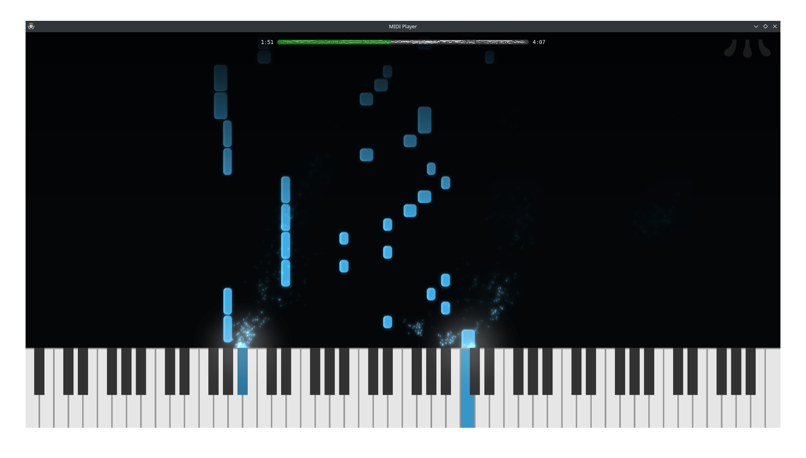
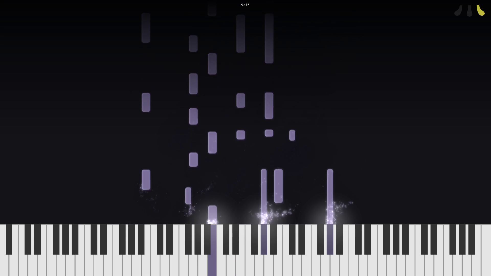

# MIDI Player

**MIDI Player** (probably needs some better name) is a "beautiful" MIDI renderer. It's free and open source (BSD 2-Clause license).

The app is still in development. It probably contains many dumb bugs and is definitely not fully functional.

## Features

* Input/output from/to .mid files and MIDI devices
* Rendering:
    * Raw frames for now, needs `ffmpeg` to actually turn into a video - see [example script](/render.sh)
    * No sound on videos
    * Only **RGBA 1920x1080 60 fps** is supported
* [Configuration](/docs/ConfigFile.md), with "hot reload" support
* Various customization options:
    * Background (single color or image)
    * Tiles (also depending on channel or index)
    * Particles
    * And more...
    * Styles can be changed at specific timings or various [conditions](/docs/ConfigFile.md#conditions)
* Marking timestamps that you can use for configuration
* WIP: Inserting custom events (so that you can make e.g. subtitles)
    * Only TextEvents are supported

Only Linux is supported as the target platform for now. There is no GUI configuration for now. I plan to make a simple Qt-based configurator in the future.

## Things that I (want to) work on

* Other platforms than Linux
* Customization of video format (framerate, resolution,...)
* Event triggers (so you can change styling when e.g a piano key is pressed)

## Building / Installing

There are no binary distributions for now as I find the "basic" version not finished; you will need to build it from source.

See [build instructions](/docs/Build.md) for more details.

## Setting up

The two sources can be used for setting up the app:

* command line (see `midiplayer --help` for up-to-date help)
* config files (see [documentation](/docs/ConfigFile.md)).

## Documentation

* [Build instructions](/docs/Build.md)
* [Config files](/docs/ConfigFile.md)
* [Key bindings](/docs/Keybinds.md)
* [Markers](/docs/Markers.md)
