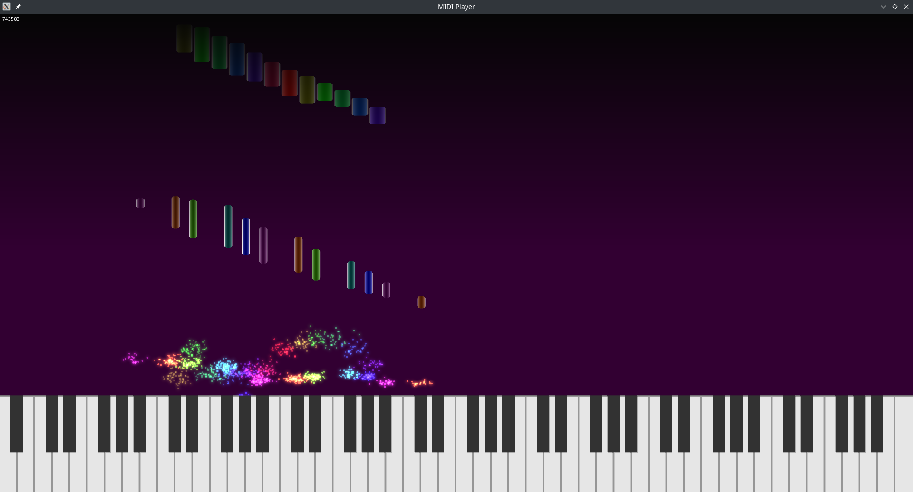

# MIDI Player

**MIDI Player** (probably needs some better name) is a "beautiful" MIDI renderer. It's free and open source (BSD 2-Clause license).

Some basic features:
* MIDI input: realtime display and saving to MIDI files
* Playing MIDI files (but no MIDI output for now)
* Rendering:
    * Raw frames for now, needs `ffmpeg` to actually turn into a video - see [example script](./render.sh)
    * Only **RGBA 1920x1080 60 fps** is supported
* Various customization options:
    * Background (single color or image)
    * Tile color (depending on channel or index)
    * Particle properties (count, size, glow size)
    * Label font, fade time
    * And more...

Only Linux is supported as the target platform for now. Other platforms don't even have MIDI input implemented.

Things that I (want to) work on:
* Other platforms
* MIDI output
* Inserting custom events (so that you can make e.g. subtitles)
* Changing styling when the track is playing (e.g at some time or when a key is pressed)
* Customization of video format (framerate, resolution,...)

The app is still in development, it has probably many dumb bugs and is definitely not fully functional (see e.g MIDI output, Windows support, etc.).

## Building / Installing

There are no binary distributions for now as I find the "basic" version not finished; you will need to build it from source.

See [build instructions](./docs/Build.md) for more details.

## Setting up

The two sources can be used for setting up the app:

* command line (see `midiplayer --help` for up-to-date help)
* config files (see [documentation](./docs/ConfigFile.md)).

### GUI Version?

There is no GUI configuration for now. I plan to make a simple Qt-based configurator in the future.
